# AFN Unificado - Linguagem Coral

Este documento contém um único Autômato Finito Não-Determinístico (AFN) que combina todos os AFDs da linguagem Coral através de ε-transições a partir de um estado inicial comum.

## AFN Completo

```mermaid
stateDiagram-v2
    [*] --> q0
    
    %% ========== COMENTÁRIOS EM LINHA ==========
    q0 --> qC0: ε
    qC0 --> qC1: #
    qC0 --> qC2: outro
    qC1 --> qC1: outro
    qC1 --> [*]
    qC2 --> qC2: #,outro
    
    %% ========== STRINGS ==========
    q0 --> qS0: ε
    
    qS0 --> qS1: "
    qS1 --> qS1: [^"\\n]
    qS1 --> qS2: "
    qS2 --> [*]
    
    qS0 --> qS3: '
    qS3 --> qS3: [^'\\n]
    qS3 --> qS4: '
    qS4 --> [*]
    
    qS0 --> qS5: """
    qS5 --> qS5: qualquer
    qS5 --> qS6: """
    qS6 --> [*]
    
    qS0 --> qS7: '''
    qS7 --> qS7: qualquer
    qS7 --> qS8: '''
    qS8 --> [*]
    
    %% ========== IDENTIFICADORES ==========
    q0 --> qI0: ε
    qI0 --> qI1: [a-zA-Z_]
    qI0 --> qI2: outro
    qI1 --> qI1: [a-zA-Z0-9_]
    qI1 --> [*]
    qI2 --> qI2: outro
    
    %% ========== SÍMBOLOS ==========
    q0 --> qSim0: ε
    qSim0 --> qSim1: (,),{,},;,,
    qSim1 --> [*]
    
    %% ========== OPERADORES ARITMÉTICOS/RELACIONAIS ==========
    q0 --> qOA0: ε
    
    qOA0 --> qOA1: =
    qOA1 --> [*]
    qOA1 --> qOA2: =
    qOA2 --> [*]
    
    qOA0 --> qOA3: !
    qOA3 --> qOA4: =
    qOA4 --> [*]
    
    qOA0 --> qOA5: <
    qOA5 --> [*]
    qOA5 --> qOA6: =
    qOA6 --> [*]
    
    qOA0 --> qOA7: >
    qOA7 --> [*]
    qOA7 --> qOA8: =
    qOA8 --> [*]
    
    qOA0 --> qOA9: +
    qOA9 --> [*]
    qOA9 --> qOA10: +
    qOA10 --> [*]
    qOA9 --> qOA11: =
    qOA11 --> [*]
    
    qOA0 --> qOA12: -
    qOA12 --> [*]
    qOA12 --> qOA13: -
    qOA13 --> [*]
    qOA12 --> qOA14: =
    qOA14 --> [*]
    
    qOA0 --> qOA15: *
    qOA15 --> [*]
    qOA15 --> qOA16: =
    qOA16 --> [*]
    
    qOA0 --> qOA17: /
    qOA17 --> [*]
    qOA17 --> qOA18: =
    qOA18 --> [*]
    
    qOA0 --> qOA19: %
    qOA19 --> [*]
    qOA19 --> qOA20: =
    qOA20 --> [*]
    
    %% ========== OPERADORES LÓGICOS ==========
    q0 --> qOL0: ε
    
    qOL0 --> qOL1: E
    qOL0 --> qOL2: O
    qOL0 --> qOL4: N
    qOL0 --> qOL7: outro
    
    qOL1 --> qOL7: outro
    qOL1 --> [*]
    
    qOL2 --> qOL3: U
    qOL2 --> qOL7: outro
    qOL3 --> qOL7: outro
    qOL3 --> [*]
    
    qOL4 --> qOL5: A
    qOL4 --> qOL7: outro
    qOL5 --> qOL6: O
    qOL5 --> qOL7: outro
    qOL6 --> qOL7: outro
    qOL6 --> [*]
    
    qOL7 --> qOL7: outro
    
    %% ========== OPERADORES BOOLEANOS ==========
    q0 --> qOB0: ε
    
    qOB0 --> qOB1: V
    qOB1 --> qOB2: E
    qOB2 --> qOB3: R
    qOB3 --> qOB4: D
    qOB4 --> qOB5: A
    qOB5 --> qOB6: D
    qOB6 --> qOB7: E
    qOB7 --> [*]
    
    qOB0 --> qOB8: F
    qOB8 --> qOB9: A
    qOB9 --> qOB10: L
    qOB10 --> qOB11: S
    qOB11 --> qOB12: O
    qOB12 --> [*]
    
    %% ========== DECIMAIS ==========
    q0 --> qD0: ε
    
    qD0 --> qD1: [0-9]
    qD0 --> qD4: outro
    
    qD1 --> qD1: [0-9]
    qD1 --> qD2: .
    qD1 --> qD4: outro
    qD1 --> [*]
    
    qD2 --> qD3: [0-9]
    qD2 --> qD4: outro
    
    qD3 --> qD3: [0-9]
    qD3 --> qD4: outro
    qD3 --> [*]
    
    qD4 --> qD4: [0-9],.,outro
    
    state "q0 (inicial)" as q0
```

