# AFD Unificado - Linguagem Coral

Este documento contém o Autômato Finito Determinístico (AFD) resultante da conversão do AFN unificado através do algoritmo de **Construção de Subconjuntos** (Subset Construction).

## Conversão AFN → AFD

O AFD foi construído a partir do AFN eliminando:
- **ε-transições**: Calculando ε-closure de cada estado
- **Não-determinismo**: Cada estado do AFD representa um conjunto de estados do AFN
- **Estado inicial do AFD**: ε-closure(q0) = {q0, qC0, qS0, qI0, qSim0, qOA0, qOL0, qOB0, qD0}

O AFD resultante é completamente determinístico: para cada par (estado, símbolo) existe exatamente uma transição.

---

## Diagrama do AFD Unificado

```mermaid
stateDiagram-v2
    [*] --> S0
    
    S0 --> S_HASH: #
    S0 --> S_ASPAS_DUPLA: "
    S0 --> S_ASPAS_SIMPLES: '
    S0 --> S_LETRA: [a-zA-Z_]
    S0 --> S_SIMB_ABRE: (
    S0 --> S_SIMB_FECHA: )
    S0 --> S_SIMB_CHAVE_A: {
    S0 --> S_SIMB_CHAVE_F: }
    S0 --> S_SIMB_VIRGULA: ,
    S0 --> S_EQ: =
    S0 --> S_NOT: !
    S0 --> S_LT: <
    S0 --> S_GT: >
    S0 --> S_PLUS: +
    S0 --> S_MINUS: -
    S0 --> S_MULT: *
    S0 --> S_DIV: /
    S0 --> S_MOD: %
    S0 --> S_E: E
    S0 --> S_O: O
    S0 --> S_N: N
    S0 --> S_V: V
    S0 --> S_F: F
    S0 --> S_DIGITO: [0-9]
    
    %% COMENTÁRIOS
    S_HASH --> S_HASH: [^\\n]
    S_HASH --> S_COMENTARIO_FIM: \\n
    S_COMENTARIO_FIM --> [*]
    
    %% STRINGS ASPAS DUPLAS
    S_ASPAS_DUPLA --> S_ASPAS_DUPLA: [^"\\n]
    S_ASPAS_DUPLA --> S_STRING_DUPLA_FIM: "
    S_STRING_DUPLA_FIM --> S_ASPAS_DUPLA2: "
    S_ASPAS_DUPLA2 --> S_TRIPLA_DUPLA: "
    S_TRIPLA_DUPLA --> S_TRIPLA_DUPLA: qualquer
    S_TRIPLA_DUPLA --> S_TRIPLA_D1: "
    S_TRIPLA_D1 --> S_TRIPLA_DUPLA: [^"]
    S_TRIPLA_D1 --> S_TRIPLA_D2: "
    S_TRIPLA_D2 --> S_TRIPLA_DUPLA: [^"]
    S_TRIPLA_D2 --> S_STRING_TRIPLA_D_FIM: "
    S_STRING_DUPLA_FIM --> [*]
    S_STRING_TRIPLA_D_FIM --> [*]
    
    %% STRINGS ASPAS SIMPLES
    S_ASPAS_SIMPLES --> S_ASPAS_SIMPLES: [^'\\n]
    S_ASPAS_SIMPLES --> S_STRING_SIMPLES_FIM: '
    S_STRING_SIMPLES_FIM --> S_ASPAS_SIMPLES2: '
    S_ASPAS_SIMPLES2 --> S_TRIPLA_SIMPLES: '
    S_TRIPLA_SIMPLES --> S_TRIPLA_SIMPLES: qualquer
    S_TRIPLA_SIMPLES --> S_TRIPLA_S1: '
    S_TRIPLA_S1 --> S_TRIPLA_SIMPLES: [^']
    S_TRIPLA_S1 --> S_TRIPLA_S2: '
    S_TRIPLA_S2 --> S_TRIPLA_SIMPLES: [^']
    S_TRIPLA_S2 --> S_STRING_TRIPLA_S_FIM: '
    S_STRING_SIMPLES_FIM --> [*]
    S_STRING_TRIPLA_S_FIM --> [*]
    
    %% IDENTIFICADORES
    S_LETRA --> S_LETRA: [a-zA-Z0-9_]
    S_LETRA --> [*]
    
    %% SÍMBOLOS
    S_SIMB_ABRE --> [*]
    S_SIMB_FECHA --> [*]
    S_SIMB_CHAVE_A --> [*]
    S_SIMB_CHAVE_F --> [*]
    S_SIMB_VIRGULA --> [*]
    
    %% OPERADORES ARITMÉTICOS/RELACIONAIS
    S_EQ --> [*]
    S_EQ --> S_EQ_EQ: =
    S_EQ_EQ --> [*]
    
    S_NOT --> S_NOT_EQ: =
    S_NOT_EQ --> [*]
    
    S_LT --> [*]
    S_LT --> S_LT_EQ: =
    S_LT_EQ --> [*]
    
    S_GT --> [*]
    S_GT --> S_GT_EQ: =
    S_GT_EQ --> [*]
    
    S_PLUS --> [*]
    S_PLUS --> S_PLUS_PLUS: +
    S_PLUS_PLUS --> [*]
    S_PLUS --> S_PLUS_EQ: =
    S_PLUS_EQ --> [*]
    
    S_MINUS --> [*]
    S_MINUS --> S_MINUS_MINUS: -
    S_MINUS_MINUS --> [*]
    S_MINUS --> S_MINUS_EQ: =
    S_MINUS_EQ --> [*]
    
    S_MULT --> [*]
    S_MULT --> S_MULT_EQ: =
    S_MULT_EQ --> [*]
    
    S_DIV --> [*]
    S_DIV --> S_DIV_EQ: =
    S_DIV_EQ --> [*]
    
    S_MOD --> [*]
    S_MOD --> S_MOD_EQ: =
    S_MOD_EQ --> [*]
    
    %% OPERADORES LÓGICOS
    S_E --> [*]
    
    S_O --> S_OU: U
    S_OU --> [*]
    
    S_N --> S_NA: A
    S_NA --> S_NAO: O
    S_NAO --> [*]
    
    %% OPERADORES BOOLEANOS
    S_V --> S_VE: E
    S_VE --> S_VER: R
    S_VER --> S_VERD: D
    S_VERD --> S_VERDA: A
    S_VERDA --> S_VERDAD: D
    S_VERDAD --> S_VERDADE: E
    S_VERDADE --> [*]
    
    S_F --> S_FA: A
    S_FA --> S_FAL: L
    S_FAL --> S_FALS: S
    S_FALS --> S_FALSO: O
    S_FALSO --> [*]
    
    %% DECIMAIS
    S_DIGITO --> S_DIGITO: [0-9]
    S_DIGITO --> [*]
    S_DIGITO --> S_PONTO: .
    S_PONTO --> S_DECIMAL: [0-9]
    S_DECIMAL --> S_DECIMAL: [0-9]
    S_DECIMAL --> [*]
    
    state "S0: Estado Inicial" as S0
```

